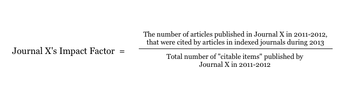

# History of bibliometrics

The field of bibliometrics, sometimes scientometrics, has existed for many years and has created a set of methods to quantitatively analyse scientific and technological literature [Bibliometrics and Citation Analysis: From the Science Citation Index to Cybermetrics; De Bellis; 2009]. These metrics are most commonly used to measure the impact, or value, of the research in question. This impact ranking has a diverse set of applications, including assessment of an author's work. One of the most widely used methods is the Impact Factor, sometimes known as the Journal Impact Factor.  It was first proposed by Eugene Garfield in 1972, in his paper, _Citation Analysis As A Tool in Journal Evaluation_. The impact factor is calculated using the following algorithm:

The _Journal Citation Reports_ is published annually by Thomson Reuters, listing all known journals and giving their impact factor, and other metrics for the current year. Neylon and Wu [Article-Level Metrics and the Evolution of Scientific Impact; Neylon & Wu, 2009] state that "most scientists … will point to the Thomson ISI Journal Impact Factor as an external and 'objective' measure for ranking the impact of specific journals and the individual articles within them".

Usage of the impact factor in ranking research other than journals has become more widespread. Increasingly, impact factor has become a proxy for measuring many diverse research outputs. These range from comparisons of international impact to individual article value [Cash for papers: putting a premium on publication; Fuyuno & Cyranoski; 2006]  [Nefarious Numbers; Arnold & Fowler; 2010]  [The History and Meaning of the Journal Impact Factor; Garfield; 2006]. Article value is calculated by proxy, by simply taking the impact factor from the journal it was published in. This has lead to ranking author value, by totalling the impact factor of each paper published.

Because of it's wide-ranging use, the impact factor has a strong influence on the scientific community. This has affected decisions on where to publish, whom to promote or hire, the success of grant applications, library decisions to purchase and renew journal subscriptions, researchers deciding where to publish, researchers choice on what to read and even salary bonuses [Show Me The Data; Rossner, Van Epps & Hill; 2007]  [Nefarious Numbers; Arnold & Fowler; 2010]. The Public Library of Science Medicine (PLoS Medicine) Editors report that "in some countries, government funding of entire institutions is dependent on the number of publications in journals with high impact factors" [It is time to find a better way to assess the scientific literature; The PLoS Medicine Editors; 2006]. 

In the UK, governmental assessment of Higher Education institutions have been conducted by the Research Assessment Exercise (RAE) since 1986. The exercise relied on the "subjective assessment of scientific publications by a panel of experts". Because of this, the RAE was time-consuming and expensive, costing the UK Government £12 million and universities an additional £47 million [The Assessment of Science: The Relative Merits of Post-Publication Review, the Impact Factor, and the Number of Citations; Eyre-Walker & Stoletzki; 2013]. In 2014, the RAE will be replaced by the Research Excellence Framework (REF). The REF will controversially provide more focus research impact, with 25% of the final grading going towards measurement of value [Humanities research threatened by demands for 'economic impact'; Shepherd; 2009]. Allen, Jones and Dolby believe that it is the impact factor's place as the key indicator of research progression that provides much of the rationale for the move to a more metrics-based successor [Looking for landmarks: the role of expert review and bibliometric analysis in evaluating scientific publication outputs; Allen, Jones & Dolby; 2009].

* h-index & other metrics (?)
* Historical use cases (?)
	* Live peer review
	* Filtering (linked to above)
	* Performance review
		* Funding
		* Tenure
* Forms of impact (?)

# Failings of traditional metrics

The impact factor has been the subject of much criticism, with many papers reporting on its faults. Increasingly, scientists have been calling for an end to the wide-ranging use of the impact factor. In December 2012, researchers at the annual meeting of the American Society for Cell Biology signed the Declaration on Research Assessment, calling for the end of the use of journal metrics to assess individual articles or authors.

Arnold & Fowler report that "the allure of the impact factor as a single, readily available number - not requiring complex judgments or expert input, but purporting to represent journal quality - has proven irresistible to many". It is this inherent simplicity that lead to the rise of the impact factor. As we shall see, this simplicity fails to interpret the scope and complexity of scientific impact.

As explained above, the impact factor has been used as a proxy for other forms of impact - primarily article or author impact. This is problematic, as the impact factor was simply not designed to measure anything other than journal impact [Article Level Metrics and the Evolution of Scientific Impact]. Even Garfield has criticised this usage. In his paper, _How to Use Citation Analysis for Faculty Evaluations, and When Is It Relevant?_, he states that citation analysis can augment author assessment, but find that it is easily misinterpreted or inadvertently manipulated [How to Use Citation Analysis for Faculty Evaluations, and When Is It Relevant?; Garfield; 1983]. Additionally, the current publishers of the impact factor, Thomson Reuters have admitted that it is being used in "many inappropriate ways" [It is time to find a better way to assess the scientific literature; The PLoS Medicine Editors; 2006].

* _Journal_ IF used as proxy for other factors
	* Article & author impact ranks are implied
		* Only design to rank journals
	* Even criticised by Garfield
		* [How to Use Citation Analysis for Faculty Evaluations, and When Is It Relevant?; Garfield; 1983]
		* Thomson Reuters have also acknowledged that the IF is being used in inappropriate ways

Scientific publishing has grown to an incredible rate, with over 800 000 papers published in 2008 in PubMed alone [Article Level Metrics and the Evolution of Scientific Impact; Neylon & Wu; 2009]. This has grown to nearly 950 000 papers in 2013 [2013 PubMed Search Results; nd]. Mendeley, a research paper bookmarking service found that researchers spent an average of 1:12 hours per day studying literature [Global Research Report; 2009]. Neylon and Wu claim this growth has overwhelming for researchers - "It [is] impossible for any scientist to read every paper relevant to their research, and a difficult choice has to be made about which papers to read" [Article Level Metrics and the Evolution of Scientific Impact; Neylon & Wu; 2009]. Traditional forms of filtering, namely, peer review and the impact factor, are overwhelmed by the scale of modern research [Altmetrics Manifesto; Priem, Taraborelli, Groth &  Neylon; 2010].

* Volume of articles published
	* Authors/assessors overwhelmed - what to read?
	* Total number of papers in PubMed up to 2008 is 19 million

* Time delay in accumulating citations
	* Relates to below, filtering of (new) articles required, IF not fast enough to provide this
	* Time delays of 1-2 years or more
	* Citations appear months (at the earliest) after publication

* "Mathematically problematic"
	* 80% of IF attributable to 20% of papers
	* Can be "badly skewed by a blockbuster paper"
	* * Only 15% to 20% of scientists in the US have authored a refereed article
* Rich get richer problem
	* Papers in high IF journals are likely to get more citations, irrespective of how valuable the paper is
	* "[It is] therefore possible that the correlation … was a consequence of assessors rating papers in high profile journals more highly, rather than an ability of assessors to judge the intrinsic merit or likely impact of a paper"
* Doesn't acknowledge that sometimes the body of an authors work is not in a published paper
	* Articles sum up work, but work that supports the article is ignored
	* "Citation is occurring in new ways, scientific thinking is not always propagated via the published article"
	* Doesn't measure impact outside of scientific community
		* Magazine sections, aimed at a layman audience, add 'value' by interpreting science and helping to set agendas (i.e. have greater 'impact'), but get no credit in the IF
* Doesn't take network effects into account
	* "Only represents the popularity factor of status, not its prestige factor"
		* Popularity: "total number of endorsements", prestige: "the prestige of endorsing actors"
		* Needs to become more like Google's PageRank
		* Investigated by webometrics movement
			* Found "significant, but meaningful discrepancies" between PankRank-like algorithm and the IF
* Method is proprietary & trade secret
	* Esp. bad considering it's influence over employment - should be open
	* Evidence that Thomson Reuters have misidentified article types - affects IF
		* "The total number of citations for each journal was substantially fewer than the number published on the JCR website"
	* Wouldn't provide data used to calculate IF
		* Primary data unavailable, it wouldn't be accepted as a paper - _unscientific_
	* "It became clear that the process of determining a journal's impact factor is unscientific and arbitrary"
	* It is not clear whether Thomson Scientific could measure ... individual article citations accurately"
	* "The final calculations for impact factors are largely unknown, and the underlying data are not subject to independent audit"
	* IF is not reproducible
* Citations to retracted papers still count towards the IF
	* Example: "Woo Suk Hwang's stem cell papers in Science from 2004 and 2005, both subsequently retracted, have been cited a total of 419 times"
* Problems with gaming
	* Publishing papers that garner many citations
		* Review articles (articles that review the journal's output - i.e. cites the journal a lot), data heavy articles
	* "There have also been widespread complaints by authors of manuscripts under review, who were asked or required by editors to cite other papers from the journal"
		* "This practice borders on extortion"
* Encourages bad scientific practices
	* "The current promotion system, however, discourages publishing research with negative results"
		* Papers with negative results don't get many citations
		* Therefore there is no incentive
	* [Are Alternative Metrics Still Alternative?; Buschman & Michalek; 2013] find that blogs are increasingly used to publish negative results, methods
* Terms of use restrictions (limits of webometrics)
	* "Webometric approaches that rely on search engines are fundamentally limited by terms of use restrictions on automated mining of results"
	* "Global usage data are generally wrapped in mystery by the publishers"
* Criticism of the REF
	* "Both subjective review and the number of citations are very error prone measures of merit, so it seems likely that [the REF] will also be extremely error prone, particularly given the volume of assessments that need to be made"
	* Criticism of all metric based measurement
		* In an ideal world, all assessment would be done subjectively
		* However there is too much research for this to be feasible
		* Metrics should be a tool to assist subjective assessment