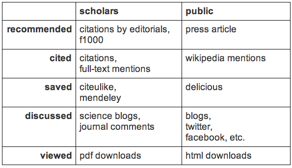

# Final Year Project
### Lit Review - What is altmetrics?

* [Altmetrics Manifesto; Priem, Taraborelli, Groth &  Neylon; 2010](http://altmetrics.org/manifesto/)
	* "In growing numbers, scholars are moving their everyday work to the web"
	* "New forms [of communication] reflect and transmit scholarly impact"
	* "Expand our view of what impact looks like, but also of what’s making the impact"
* [Soft peer review: social software and distributed scientific evaluation; Taraborelli; 2008](http://discovery.ucl.ac.uk/8279/1/8279.pdf)
	* _Usage factors_
		* e.g. PLoS ALM
		* "Enable tracking popularity metrics such as the number of views or downloads per article"
	* _Social reference managers_
		* "Becoming powerful and costless solutions to collect large sets of metadata, in this case socially aggregated metadata on scientific literature"
			* "An item in an online bookmarking system is described by a list of tags, ratings, annotations compiled by the user when filing the item in his or her library"
* [Article Level Metrics and the Evolution of Scientific Impact; Neylon & Wu; 2009](http://www.plosbiology.org/article/info:doi/10.1371/journal.pbio.1000242)
	* Article Level Metrics
		* Instead of using "journal-level metrics" [the JIF], we use "article-level metrics" - metrics targeted at the specific article
	* Social reference managers
		* "[Social reference managers] may also eventually be able to track the amount of time users spend viewing papers within their interface"
		* "The user usually has the option of adding tags, comments, or ratings as part of the bookmarking process"
		* "Scientists collect the papers they find interesting, take notes on them, and store the information in a place that is accessible and useful to them"
		* "By broadcasting what papers they think are important, researchers are directly influencing the research community's choice of reading and discussion material"
	* "There are numerous article-level metrics"
* [Clickstream Data Yields High Resolution Maps of Science; Bollen et al](http://www.plosone.org/article/info%3Adoi%2F10.1371%2Fjournal.pone.0004803)
	* "A journal clickstream model, i.e. a first-order Markov chain, was extracted from the sequences of user interactions in the logs"
		* Models user as they click through system
	* "The number of logged interactions [with research paper collections] now greatly surpasses the volume of all existing citations"
	* "They record the interactions of all users of scholarly portals, including scientific authors, practitioners of science, and the informed public"
	* Cited by [Article Level Metrics and the Evolution of Scientific Impact; Neylon](http://www.plosbiology.org/article/info:doi/10.1371/journal.pbio.1000242): "scientific impact is not a simple concept that can be described by a single number"
* [Scientometrics 2.0; Priem & Hemminger; 2010](http://firstmonday.org/ojs/index.php/fm/article/view/2874/2570)
	* Cites [Renear and Palmer, 2009](http://www.sciencemag.org/content/325/5942/828.short)
		* "Scientists read 50 percent more papers than they did in the 1970s, spending less time on average with each one"
	* "The Web can be mined for impact indicators"
	* "[The] emergence of “Web 2.0” presents a new window through which to view the impact of scholarship"
	* "_Present[s] seven categories of Web 2.0 tools that might be productively mined_: bookmarking, reference managers, recommendation services, comments on articles, microblogging, Wikipedia, and blogging"
		* Bookmarking
			* "May be the best–developed scholarly Web 2.0 application"
			* Examples: Connotea, CiteULike, Delicious
			* "Much research into social bookmarking has examined tags and tagging"
			* Suggests tracking trends in scholar's interests from year to year, as they might change
		* Reference managers
			* Examples: Mendeley, Endnote, Zotero
			* "Provide[s] a free client that indexes and organises a user’s collection of PDF articles"
			* "Data [from] the user’s library that can be used to recommend new articles and potential collaborators"
			* Open APIs
		* Recommendation systems
			* "Can be somewhat artificially split into two sub–areas: general Web site recommendation tools, and domain–specific academic ones"
			* Examples: Slashdot, Reddit, Digg, StumbleUpon (general); Faculty of 1000 (academic)
				* [Personally I think F1000 should be in it's own category - curated systems]
				* "A hand–selected reviewers to recommend articles of interest from any journal"
				* "No plans for an API"
		* Comments on articles
			* "[Comments] on blog posts, Web articles, and other online media"
			* "Not so in the realm of online scholarly publishing, where most journals’ Web sites remain strictly one–way"
			* Cites [Commenting on scientific articles; Adie; 2009](http://blogs.nature.com/nascent/2009/02/commenting_on_scientific_artic.html)
				* "Comments may serve a variety of functions in practice, including criticism, requests for clarification, messages from the author, and supplemental materials"
				* "Nearly a fifth of PloS ONE articles have comments, most of which are substantive"
			* "The extent to which article comments reflect impact remains an open question"
		* Microblogging
			* "Twitter, the best known microblogging application, has achieved rapid and well–publicized growth"
			* Cites [How and why people Twitter: the role that micro-blogging plays in informal communication at work; Zhao and Rosson; 2009](http://dl.acm.org/citation.cfm?id=1531710)
				* "Twitter is increasingly used as a collaboration tool in work–related contexts"
		* Wikipedia
			* Cites [Scientific citations in Wikipedia; Nielsen; 2007](http://firstmonday.org/ojs/index.php/fm/article/view/1997/1872)
				* "[Wikipedia citations] correlated against numbers obtained from [Journal Citation Report]" (See above - the de facto standard for counting citations)
				* "But when citations to trusted material support statements, Wikipedia may be valuable for background reading"
			* "Consequently, frequent citation on Wikipedia would seem to be an impact worth measuring"
			* "Indeed, given that Wikipedia is often the first and only information stop for Web users, an article cited on Wikipedia has made a significant contribution to public knowledge. This should arguably count towards a scholar’s 'service' for tenure and promotion evaluation"
		* Blogging
			* "While most other Web 2.0 applications are closely identified with a few 'name–brand' services (for instance, Twitter for microblogging and Delicious for social bookmarking), blogging is not. Perhaps this reflects greater maturity of the medium"
			* "The blogging literature is much too large to review in its entirety"
			* "Mining blog posts to spot trends has been an area of active research"
			* Cites [BlogPulse: Automated trend discovery for weblogs; Glance et al; 2004](http://citeseerx.ist.psu.edu/viewdoc/summary?doi=10.1.1.118.2654) and [BlogScope: A System for Online Analysis of High Volume Text Streams; Bansal & Koudas; 2007](http://www.vldb.org/conf/2007/papers/demo/p1410-bansal.pdf)
				* "[These systems] scrape the blogosphere to spot emerging trends; instead of measuring scholarly impact, they measure the impact of news stories and memes"
			* "Blogging is increasingly being used as a platform for scholars to voice ideas in a less formal setting — one that is different from peer–reviewed publication, but still valued"
			* "The linking culture of bloggers is closely related to the citing culture of academics, and scholarly bloggers tend to credit their sources. This makes blogs a valuable source of citation data"
* _Much like any buzzword, it is all-encompassing and fluid_
	* Many different definitions of 'altmetrics' exist
	* All agree that it involves mining web-based scholarly resources
	* Some disagree on which resources
		* Some describe it as narrowly as "social reference managers"
		* Some include usage metrics
		* Others widen it even further to scraping scholarly blogs
		* (Opinion?) As the popularity of the term has increased, people have brought more under it's banner
* [How and why scholars cite on Twitter; Zhao & Rosson; 2009](http://onlinelibrary.wiley.com/doi/10.1002/meet.14504701201/full)
	* Cites [How and why people Twitter: the role that micro-blogging plays in informal communication at work; Zhao and Rosson; 2009](http://dl.acm.org/citation.cfm?id=1531710)
		* "Twitter is increasingly used as a collaboration tool in work–related contexts"
	* Cites [Understanding how Twitter is used to spread scientific messages; Letierce; 2009](http://journal.webscience.org/314/)
	* "[Tweets are] not typically offered in support of an argument"
		* "I would compare tweeting a scholarly article to bringing it up in a seminar or a classroom situation"
	* Found that 6% of sampled tweets
		* 52% directly linked to papers
		* 48% linked to a third-party, which then either linked to a paper or described a paper ("second-order links")
	* "In interviews, participants emphasized that they saw citing on Twitter as part of a dynamic, ongoing conversation"
	* "Because scholars on Twitter typically follow people both in  and out of their particular subfields, these conversations and the citations that accompany them often afford a more interdisciplinary perspective"
	* "Twitter citations [tweets that contain links to papers] are more likely than other links to be original, rather than retweets"
	* "39% of citations refer to articles less than one week old, and 15% of citing tweets refer to articles published that same day"
	* "[Tweets] represent and transmit scholarly impact"
* [Studying Scientific Discourse on the Web Using Bibliometrics: A Chemistry Blogging Case Study; Groth & Gurney; 2010](http://journal.webscience.org/308/)
	* "[Scientific discourse] is not separate from traditional academic discourse in published papers, but is intertwined with it: blogs etc. are increasingly referring to, and commenting on, traditional publications."
	* "Blogs in general are examples of participatory journalism, with scientific blogs primarily addressing issues and topics that are published in academic journals but also extending to scientific issues of interest to the public (e.g. global warming or health policy)"
	* Finds that "scientific discourse on the Web is more immediate" and that posts that discuss newer articles get more page views
	* "Current posts will often refer back to older publications whilst putting the knowledge contained within them into a more modern context"
	* "Scientific discourse on the Web focuses on high quality science"
		* "70.5% of the publications were in high-impact journals"
		"21% of the papers appear in the top 60 publications over all fields"
	* "Scientific discourse on the Web includes the non-technical implications of science"
		* "Most of the [titles] describe the implications of science"
		* "The ability of blogs to present scientific research to a potential audience of non-academic but interested people is apparent"
* [Altmetrics in the Wild: Using Social Media to Explore Scholarly Impact; Priem, Piwowar, Hemminger; 2012](http://arxiv.org/abs/1203.4745)
	* "Tools [used by researchers] include social reference managers, Twitter, blogs, bookmarking services, and more"
* [Thoughts from the Fishbowl: PLOS ALM Workshop 2013; Liu; 2003](http://www.altmetric.com/blog/thoughts-from-the-fishbowl-plos-alm-workshop-2013)
	* "What is the difference between article-level metrics and altmetrics?"
		* "'Altmetrics' is the umbrella term for new ways (both qualitative and quantitative) of measuring different forms of impact"
		* "'Article-level metrics' has colloquially come to mean the altmetrics surrounding a scholarly paper, although technically it could include traditional bibliometrics, such as citations"
		* Quotes Jason Priem:
			* "'Article-level metrics' didn’t completely cover what he felt should be conveyed [when he coined the term altmetrics]"
			* Instead wanted the term to convey "metrics of impact drawn from activity on online tools and environments"
		* Quotes Kaitlin Thaney:
			* "Suggested that altmetrics tracked 'a researcher’s footprint in the community'"
* [What Can Article-Level Metrics Do for You?; Fenner; 2013](http://www.plosbiology.org/article/info:doi/10.1371/journal.pbio.1001687)
	* "The _scientific impact_ of a particular piece of research is reflected in how this work is taken up by the scientific community"
	* "Scientific impact is a multi-dimensional construct that can not be adequately measured by any single indicator"
	* "When readers first see an interesting article, their response is often to view or download it. By contrast, a citation may be one of the last outcomes of their interest, occurring only about 1 in 300 times a PLOS paper is viewed online"
		* Implies a ranking/range of engagement - citing shows more engagement than a view/download
			* Doesn't however cover levels of access to more engaged metrics - i.e. not everyone can write a research paper in which to cite!
	* "The use of social media discussion platforms, such as Twitter and Facebook for example, has increased in recent years"
		* "93% of PLOS Biology research articles published since June 2012 have been discussed on Twitter, and 63% mentioned on Facebook"
* [Altmetrics in Evolution: Defining and Redefining the Ontology of Article-Level Metrics; Lin & Fenner; 2013](http://www.niso.org/publications/isq/2013/v25no2/lin/)
	* Attempts to define a taxonomy for metrics
		* As an update to PLoS' ALM categorisation
	* Primary metrics: "includes the raw counts of activity captured by each source"
	* Secondary metrics: "comprised of descriptive statistics that give context to the primary metrics (e.g., article view to PDF download ratio and average usage of similar papers)"
	* "Our approach ultimately consisted of a single determinant: the _purpose_ and _nature_ of measurement"
		* "We moved from an emphasis on the data source itself to the underlying activity captured by the data source"
	* Found a "natural accession of increasing interest in and level of engagement with the research articles"
	* List of categories:
		* "Viewed - activity of users accessing the article online"
		* "Saved - activity of saving articles in online bibliography managers, which helps researchers organize papers for themselves and as well as share them with others"
		* "Discussed - discussions of the research described in an article (ranging from a short comment shared on Twitter to more in-depth comments in a blog posting)"
		* "Recommended - activity of a user formally endorsing the research article (via a platform such as an online recommendations channel)"
		* "Cited - Formal citation of an article in other scientific journals"
	* "We see a concurrent need to harmonize the aggregation and treatment of the data across all journals and third-party providers of ALM and altmetrics data"
		* "While there seems to be overall agreement to see citations and usage stats as groups distinct from altmetrics, there is currently no consensus on how to group altmetrics"
* [A new framework for altmetrics; ImpactStory blog; 2012](http://blog.impactstory.org/2012/09/14/31524247207/)
	* "We suggest categorizing metrics along two axis: engagement type and audience"

* [Exploring the Boundaries: How Altmetrics Can Expand Our Vision of Scholarly Communication and Social Impact; Taylor; 2013](http://www.niso.org/publications/isq/2013/v25no2/taylor/)
	* "Just as bibliographic citation is the formal referencing of one work by another, so is much of the data in altmetrics the formal referencing of a work"
	* "It is assumed that different disciplines will have different social citation patterns."
* [Institutional Altmetrics and Academic Libraries; Roemer & Borchardt; 2013](http://www.niso.org/publications/isq/2013/v25no2/roemer/)
	* "It has frequently been noted by both librarians and information scientists that researchers in STEM disciplines tend to emphasize the production and consumption of journal articles more heavily than scholars in the humanities or social sciences, for whom book–length works and monographs are also highly valued"
		* "Consequently, faculty in the humanities and social sciences have predominantly based their impact narratives on qualitative indicators"
		* Possible that altmetrics might offer quantative measures, at least in terms of wider (social) impact
		* "The Book Citation Index [a Thomson Reuters product] is still a tool in its infancy, and therefore should not yet be used to evaluate faculty impact"
	* "The Social Science Research Network (SSRN) has been of similar value to non–STEM researchers, due to its statistical tracking of per-article downloads and citations"
* [Social Signals Reflect Academic Impact: What it Means When a Scholar Adds a Paper to Mendeley; Gunn; 2013](http://www.niso.org/publications/isq/2013/v25no2/gunn/)
	* Detailed description of Mendeley (written by Mendenley employee)
		* "It has broad adoption across disciplines with the largest numbers of researchers currently in life sciences, chemistry, math, and computer science, but also with representation from the social sciences and non-journal based humanities disciplines as well"
		* "[Mendeley often has] greater than 90% of recent issues of many journals"
		* API
			* Author supplied keywords
				* "Any tags that an individual user has added can only be retrieved by permission of the user through a separate user-specific call for the document details"
			* Identifiers
				* "PubMed ID (PMID), an arXiv ID, a DOI, an ISBN, or an ISSN"
			* Stats
				* "Number of Mendeley users who have a given document in their library" - "updated approximately daily"
				* "[A] breakdown of the disciplines of the readers, given as whole number percents of the total readership"
		* "[The Mendeley document catalog] currently 420 million documents, increasing about a half a million a day"
			* "If there is duplication [of a document], the number of clusters is usually around three to five, with readers distributed randomly among them"
				* "Once Mendeley builds a “ground truth” set of metadata into the catalog via Scopus, documents will be assigned to a permanent cluster, anchored to the canonical metadata, where available"
* [Altmetrics: Rethinking the Way We Measure; Galligan & Dyas-Correia; 2013](http://www.sciencedirect.com/science/article/pii/S009879131300004X)
	* Cites [As Scholarship Goes Digital, Academics Seek New Ways to Measure Their Impact; Howard; 2012](http://chronicle.com/article/As-Scholarship-Goes-Digital/130482/)
		* "Altmetrics — short for alternative metrics — aims to measure Web-driven scholarly interactions, such as how research is tweeted, blogged about, or bookmarked"
	* Cites [Altmetrics: impact, landscape, their value to the library; Galligan; 2012](http://www.swets.com/blog/altmetrics-for-librarians-and-institutions-part-i)
		* "Altmetrics are new measurements for the impact of scholarly content, based on how far and wide it travels through the social Web, social bookmarking and collaboration tools … What altmetrics hope to do is provide an alternative measure of impact, distinct from the Journal Impact Factor, which has been categorically misused and is unable to respond to the digital environment that scholarship takes place in today"
	* "The new metrics offer the possibility to discover new insights into impact that have been previously impossible to obtain, and they are fast compared to traditional metrics"
	* Altmetric tools and software
		* Plum Analytics
		* [CitedIn](http://citedin.org)
			* Find citations using PubMed identifier from blogs, databases, and Wikipedia
		* [ReaderMeter](http://readermeter.org)
			* "Measures the use of scientific content by a large number of readers". Data obtained from the Mendeley API
		* [ScienceCard](http://sciencecard.org)
			* Collects article-level statistics for scientific articles. Data obtained from Twitter, Mendeley, PubMed Central, CiteULike, Wikipedia and CrossRef
		* ImpactStory
		* Altmetric.com
		* PLoS Impact Explorer/Article Level Metrics
		* [PaperCritic](http://www.papercritic.com/about)
			* "Enables researchers to monitor all types of feedback about their work and also enables everyone to evaluate the work of others"
			* Powered by the Mendeley API
	* "With altmetrics, there is a sense that the users themselves should articulate how the measurements should be applied to specific problems, rather than dictated by an organization that thinks it knows best"
	* Cites [REF2014: Panel criteria and working methods; 2012](http://www.ref.ac.uk/media/ref/content/pub/panelcriteriaandworkingmethods/01_12.pdf)
		* The REF will assess universities on their "approach during the assessment period to enabling impact from its research, and case studies describing specific examples of impacts"
		* "Impact is left largely undefined in this case, which suggests some potential for altmetrics in the future"
* [How the scientific community reacts to newly submitted preprints: article downloads, Twitter mentions, and citations; Shuai, Pepe & Bollen; 2012](http://www.plosone.org/article/info%253Adoi%252F10.1371%252Fjournal.pone.0047523)
	* "Nearly 80% of the articles in the corpus reach the peak of Twitter mention just one day after they are submitted"
	* "Over 80% of arXiv.org articles are mentioned one and one day only"
	* "Twitter response to scientific articles is typically swift, yet highly ephemeral, a pattern indicative of a process in which the news of a publication is quickly passed around and very little in-depth discussion taking place afterward"
	* Finds two plausible explainations for the relationship between early tweets and article downloads
		* "Our results indeed indicate that early Twitter mentions of a paper seem to lead to more rapid and more intense download levels and subsequently higher citation levels"
		* "A manuscript of greater quality or appeal, either among the public or the scholarly community, will by virtue of this characteristic enjoy higher levels of mentions on Twitter, higher levels of downloads on arXiv, and higher levels of later citations"
		* Doesn't speculate on which is ultimately correct
* [Can tweets predict citations? Metrics of social impact based on Twitter and correlation with traditional metrics of scientific impact; Eysenbach; 2011](http://www.jmir.org/2011/4/e123/)
	* "Tweets can predict highly cited articles within the first 3 days of article publication"
	* "The majority of tweets were sent on the day when an article was published (1458/3318, 43.9%) or on the following day (528/3318, 15.9%)"
	* "The first 30 days the 'network propagation phase,' where the new information is propagated through the Twitter social network"
		* Large amount of tweets in short amount of time
	* "After 30 days, the network propagation phase gives way to what I call the 'sporadic tweetation phase,'"
		* "Only sporadic mentionings of older articles and small clusters of localized outbreaks of information propagation occur"
	* "Half of all tweets were sent by only 132 distinct tweet authors - that is, 8% of all tweet authors"
	* "The top 20% of the tweet authors accounted for 63.4% of all tweetations"
		* Tweetations - tweet citations
		* 80/20 rule
	* "There was good agreement, with a Pearson correlation coefficient of .87 for the 55 articles"
	* "The Pearson product moment correlation coefficients for the raw citation versus tweetation counts were statistically significant"
	* Tweetations were "significant predictors" of citations
	* Suggests use of 'twimpact' factor, "the absolute, cumulative number of tweetations an article receives by day 7 after publication"
* [Tweeting the meeting: an in-depth analysis of Twitter activity at Kidney Week 2011; Desai, Shariff, Shariff et al; 2012](http://www.plosone.org/article/info:doi/10.1371/journal.pone.0040253)
	* Collected tweets related to Kidney Week 2011 (using the hashtag #kidneywk11)
	* "Over 99% of informative and 70% of uninformative tweets were composed from days −2 to +3 of the conference"
		* They manually reviewed tweets to classify as informative or uninformative
		* The first day of the conference is referred to as day 0, with days before as negative day numbers and days after as positive day numbers
	* During the conference, "the ratio of uninformative to informative tweets was 1.5"
	* "The conference days with the lowest number of informative tweets and unique authors were days −2 and −1"
	* "Less than 50% of all tweets contained no citations"
	* "The mean sentiment score for all tweets was 0.094, from a range of −1.70, 2.67"
		* "Informative tweets had more negative sentiment scores than uninformative tweets"
		* "Opinion tweets had the highest mean score (0.454) amongst all types of tweets"
	* "It is important to note that a positive sentiment score is not a prerequisite for message amplification"
		* I.e. retweets
	* "Tweets were more negative during (days −2 to +3) than leading up to (days −155 to −3) the conference"
		* "One explanation could be the larger number of tweets from days 0–2 than any other time period"
		* "A second explanation could be that tweets from days 0 to +2 contained more debates and differing viewpoints"
* [Research blogs and the discussion of scholarly information; Shema, Bar-Ilan, Thelwall; 2012](http://www.plosone.org/article/info%253Adoi%252F10.1371%252Fjournal.pone.0035869)
	* "Many different motives behind science blogging"
		* "Share content and express opinions"
		* "Improve writing skills"
		* "Organize thoughts and ideas"
		* "Interact and create relationships inside and outside of the author’s home discipline"
		* "A means of establishing an online reputation"
	* "Science blogs can add to the transparency of the scientific process by reviewing and discussing the science culture in general and scientific research in particular"
	* Briefly describes the arsenic life paper story, in reference to how science blogs "may influence mainstream science"
	* "Despite the less formal format of blogs, blogging researchers express a desire to refer to papers in their blogs in a scholarly manner"
	* Researchblogging.org
		* "The site’s editors ensure that posts follow the guidelines and are of appropriate quality"
		* "Bloggers in the field of chemistry prefer to post about research published in high-impact journals"
	* 67% of bloggers in the sample were male, 18% female, 5% male-male, 4% male-female, 6% unknown
		* Cites [Wikipedia Survey – Overview of Results; Glott et al; 2010](http://www.wikipediasurvey.org/docs/Wikipedia_Overview_15March2010-FINAL.pdf)
			* "Only 12.64% of the contributors to Wikipedia are women"
	* "Most of the bloggers (59%) were either students or researchers in an academic institute"
		* "Less than a third (30%) were not affiliated with an academic institute"
	* "Seventy-two percent of the blogs have active Twitter accounts"
		* "In comparison, only 2.5% of the academics [i.e. not bloggers] studied by Priem and colleagues had active Twitter accounts"
		* "The high percentage of Twitter accounts belonging to blogs and the number of [Twitter] accounts following popular blogs show that many of the bloggers are information disseminators in more than one social medium"
	* "There is a core of quite well connected bloggers"
* [The spread of scientific information: insights from the web usage statistics in PLoS article-level metrics; Yan & Gerstein; 2011](http://www.plosone.org/article/info%253Adoi%252F10.1371%252Fjournal.pone.0019917)
	* "Once a paper is electronically published on a journal website, the information can propagate rapidly in the community"
	* "The spread of a paper will then be reflected at the level of web usage statistics, in particular, the number of HTML views"
	* "The number of citations is best correlated with the access statistics"
		* Next most correlated are CiteULike & Connotea
		* PLoS data didn't include Mendeley, Twitter, FB at the time (?)
	* "On average, the older a paper is, the less attention it receives"
		* "In particular, from the first month to the second month, the decay is rapid, while later on the decay goes slower"
	* Finds that information propagation through a scholarly community fits a simple stochastic model
		* "After a scientist has accessed a paper (and hopefully read it as well), he/she might spread the information of the paper to his friends, colleagues or students. The information would then be further spread via a cascade of social interactions"
		* "Independent from the intrinsic properties of the paper, say relevance and quality, the chance of someone passing on the information in an old paper is less than that of passing on a new paper"
	* "We found that the rate of information spread decreases as a function of time after publication, and there are two decay regimes"
		* "A rapid drop from the first month to the second month after publication"
		* "And a slow power law decay afterward"
		* Describes an initial "fame" based burst of readers, with a rapid downfall. Followed by a long tail of traditional readers, with slower decay
	* "The cumulative number of HTML views was found to follow a long tail distribution"
* [Data reuse and the open data citation advantage; Piwowar & Vision; 2013](https://peerj.com/articles/175)
	* Looks at data sets and their citation counts
		* Not directly related to altmetrics, but shows some investigation of the bibliometrics of data sets
	* "Data availability is associated with citation benefit"
		* Openly available data sets have more citations than similar closed data sets
		* "We found the open data citation benefit for this sample to be 9% overall"
	* "The benefit depended heavily on the year the dataset was made available"
		* "Datasets deposited very recently have so far received no (or few) additional citations, while those deposited in 2004–2005 showed a clear benefit of about 30%"
	* Cites Sears, 2011; Pienta, Alter & Lyle, 2010; Henneken & Accomazzi, 2011 and Dorch, 2012 (_note: not saved in Mendeley, as not sure if going to use them_)
		* All show "evidence that studies that make their data available do indeed receive more citations than similar studies that do not"
* [Who shares? Who doesn't? Factors associated with openly archiving raw research data; Piwowar; 2011](http://www.plosone.org/article/info%253Adoi%252F10.1371%252Fjournal.pone.0018657)
	* Study of reuse of data, and the researchers who reuse data
		* Again, not directly related to altmetrics, but gives overview of open data and reuse of data
	* Of the sample of papers, found that "approximately 45% of recent gene expression studies made their data publicly available"
	* Found that "authors were most likely to share data if:"
		* "They had prior experience sharing or reusing data"
		* "Their study was published in an open access journal or a journal with a relatively strong data sharing policy"
		* "The study was funded by a large number of NIH grants"
	* "Authors of studies on cancer and human subjects were least likely to make their datasets available"
* [Novelty and collective attention; Wu & Huberman; 2007](http://www.pnas.org/content/104/45/17599.full)
	* From Yan & Gerstein, 2011 - finds a "simple stochastic model" in voting statistics on digg.com
* [Adoption and use of Web 2.0 in scholarly communications; Procter, Williams, Stewart et al; 2010](http://rsta.royalsocietypublishing.org/content/368/1926/4039.full#sec-4)
	* Web 2.0 (self-reported) usage: 13% frequent users, 45% occasional users, 39% never use